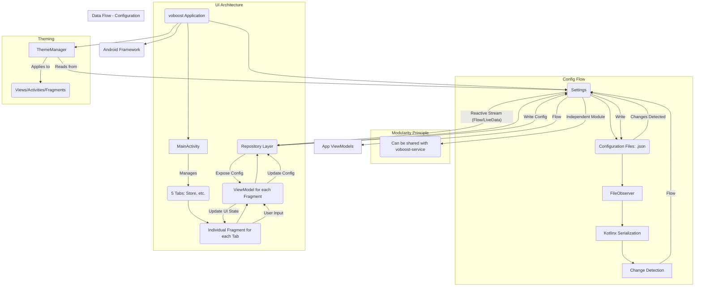

# System Patterns: voboost

## System Architecture Overview
The `voboost` project will follow a modular architecture, leveraging Android's component model and clean architecture principles to ensure maintainability, scalability, and testability. The project will consist of at least two main components: the `voboost` application (the UI-focused front-end) and the `voboost-lib-config` library (a shared configuration management backend). A separate `voboost-service` is envisioned but is out of scope for this initial development.



## Key Technical Decisions
- **Language:** Kotlin (as detailed in `projectbrief.md`).
- **Dependency Management:** Gradle with Kotlin DSL.
- **Architectural Pattern:** Model-View-ViewModel (MVVM) for UI components, combined with a layered (Repository) architecture for data handling.
- **Asynchronous Operations:** Kotlin Coroutines for all asynchronous tasks, including file I/O, network requests, and configuration change detection.
- **Reactive Programming:** Kotlin Flows for observing configuration changes and propagating updates throughout the application, ensuring a reactive UI.
- **Configuration Management:**
  ```mermaid
  graph LR
    A[Config File] --> B[FileObserver]
    B --> C[Kotlinx Serialization]
    C --> D[Validation]
    D --> E[Diff Detection]
    E --> F[Flow Updates]
    F --> G[UI Components]
    F --> H[voboost-service]
  ```
  - **Implementation:**
    - Kotlinx Serialization for JSON handling
    - FileObserver for change detection
    - Flow for reactive updates
    - Atomic writes with .tmp files
    - Automatic backup on changes
  - **Error Handling:**
    - Validation errors logged
    - Fallback to last valid config
    - User notifications for critical errors

## Design Patterns in Use
- **Repository Pattern:** To abstract data sources (configuration files, external APIs) from the rest of the application, providing a clean API for ViewModel layers.
- **Observer Pattern (via Kotlin Flow/LiveData):** Essential for reacting to configuration file changes and propagating UI updates.
- **Factory Pattern:** For creating instances of complex objects, such as different UI components based on configuration.
- **Builder Pattern:** Potentially for constructing complex configuration objects or UI elements programmatically.
- **UI Management:**
  - **ThemeManager** (singleton):
    - Handles dark/light theme switching
    - Manages theme XML resources
    - Provides LiveData for theme changes
  - **LayoutManager** (singleton):
    - Tracks display metrics changes
    - Adjusts UI through WindowMetrics
    - Handles dynamic layout updates
    - Manages application layout shift defined in application settings

## Component Relationships
- **`voboost` application:** Depends on `voboost-lib-config`. Communicates with Android system services (PackageManager, DownloadManager), and potentially external update servers.
- **`voboost-lib-config` module:** Independent of `voboost`'s UI. Handles low-level file I/O, parsing, and change detection. Designed to be reusable by `voboost-service`.
- **`ThemeManager`:** A component within `voboost` that listens to configuration changes related to themes and applies them globally or to specific UI elements.
- **Custom UI Components:** Self-contained, reusable Android Views or ViewGroups that can be easily integrated into different parts of the UI, including the drag-and-drop, message box, and select components.

## Data Storage Strategy
- **Configuration Files:** The primary storage for application settings and vehicle parameters. These will be external files accessible by `voboost` and `voboost-service`.
- **Android Preferences:** May be used for storing very lightweight, application-specific settings that don't need to be part of the external config file (e.g., internal app state).